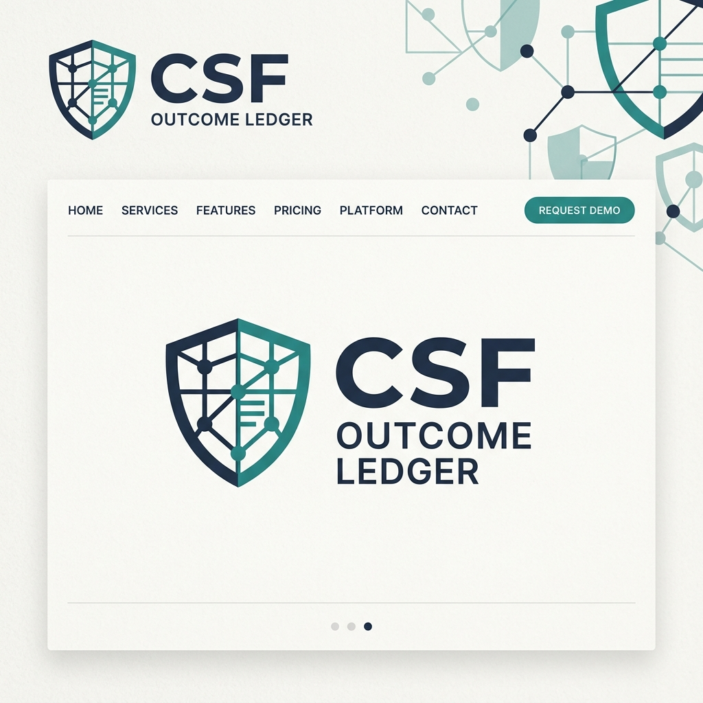

# CSF Outcome Ledger

Local-First NIST CSF 2.0 & EU DORA Workbench with CISA KEV Context & SHA-256 Provenance



[](LICENSE)
[](https://www.nist.gov/cyberframework)
[](https://csrc.nist.gov/publications/detail/sp/800-53/rev-5/final)
[](https://eur-lex.europa.eu/)

CSF Outcome Ledger is an independent, local-first web application designed for recording, mapping, and validating cybersecurity controls against NIST CSF 2.0, NIST SP 800-53 Rev. 5, ISO 27001:2022, DORA (Articles 5-14), and NIS2 (Article 21).

Unlike typical GRC platforms that collapse security posture into arbitrary percentage scores, CSF Outcome Ledger focuses on audit provenance, human mapping rationale, SHA-256 evidence hashing, and live threat feed correlation.

---

## Core Capabilities

- **NIST CSF 2.0 to SP 800-53 & ISO 27001 Mapping:** Built-in mapping database linking high-level outcomes (`PR.AA-01`, `DE.AE-01`, `PR.DS-01`) to technical control families (`AC-2`, `IA-2`, `SC-8`, `AU-2`).
- **EU DORA & NIS2 Regulatory Overlays:** Toggleable regulatory mapping for European enterprise compliance (Financial Services & Critical Infrastructure).
- **CISA KEV context:** Reads the published Known Exploited Vulnerabilities
  catalogue and shows the most recent entries with the fields CISA actually
  publishes. When the feed cannot be reached the panel shows a dated offline
  sample and says so; it never presents stale data as live. No severity or
  sector rating is invented, because CISA publishes neither.
- **Client-Side SHA-256 Evidence Hasher:** Local Web Crypto hashing of audit evidence files. Zero cloud upload—100% data sovereignty and cryptographic auditability.
- **Interactive Dependency Topology Map:** Visual node graph displaying end-to-end traceability (`Threat Feed ➔ NIST Outcome ➔ SP 800-53 Control ➔ Risk Scenario ➔ SHA-256 Evidence`).
- **One-Click CISO Executive Board Report:** Export print-ready executive summaries for CISO and Board presentations.
- **Premium Minimalist Light Aesthetic:** Gallery/editor design system (`#faf9f6` canvas, Inter & JetBrains Mono typography, muted status badges).

---

## Quick Start

### Prerequisites
- Node.js 18+ and npm

### Installation & Execution

```bash
# Clone the repository
git clone https://github.com/v-k-tsalikidis/csf-outcome-ledger.git

# Navigate into project directory
cd csf-outcome-ledger

# Install dependencies
npm install

# Run dev server
npm run dev
```

Open [http://localhost:5173](http://localhost:5173) in your web browser.

---

## Architecture & Data Sovereignty

CSF Outcome Ledger is built local-first:
1. All decision records, evidence metadata, and risk entries are stored locally in the browser (`LocalStorage` / `IndexedDB`).
2. Evidence files are hashed client-side using `window.crypto.subtle.digest('SHA-256')`. Source document contents are never transmitted across the network.
3. Network calls are restricted to fetching open threat feeds from CISA (`cisa.gov`).

---

## Documentation & Guides

- [Step-by-Step User Manual](docs/USER_MANUAL.md)
- [Troubleshooting & Setup Guide](docs/TROUBLESHOOTING.md)
- [LinkedIn Launch Presentation](docs/LINKEDIN_LAUNCH_POST.md)
- [Differentiation Brief](docs/DIFFERENTIATION_BRIEF.md)
- [Methodology Specification](docs/METHODOLOGY_SPEC.md)
- [Architecture & Design Tokens](docs/ARCHITECTURE.md)

---

## License & Disclaimer

Independent educational and portfolio project created by Vasileios (Basil) Tsalikidis. Not affiliated with or endorsed by NIST, CISA, NATO, the European Union, or any commercial entity.

Licensed under the MIT License.
